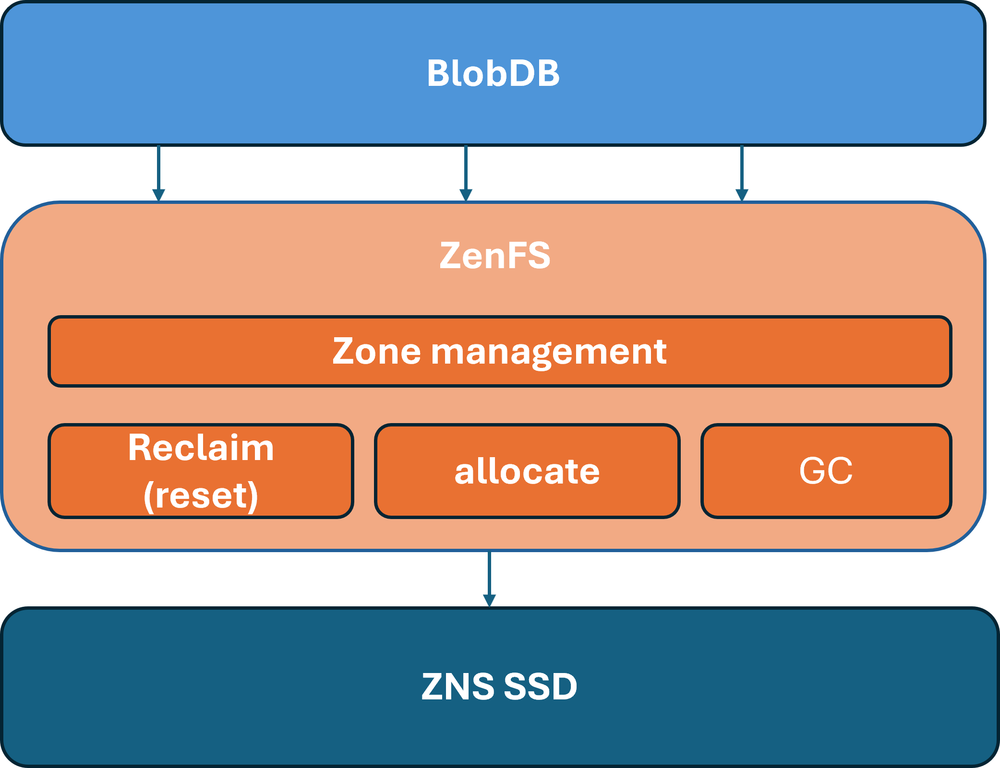

### 1. 프로젝트 배경
#### 1.1. 국내외 시장 현황 및 문제점

오늘날 많은 어플리케이션은 계산 중심이 아닌 데이터 중심적이다. 다양한 데이터를 다룰 일이 점점 증가하는 추세이며, 이에 따라 관계형 모델을 채택하지 않은 DB(Database)의 수요도 늘고 있다. 이러한 DB를 NoSQL이라 부르기도 하며, 키-밸류 스토어도 여기에 속한다. 특히 LSM-Tree(Log-Structured Merge Tree) 구조의 키-밸류 스토어를 많이 활용한다. 이러한 LSM-Tree는 쓰기 위주의 워크로드에 강하며, 랜덤 쓰기를 순차 쓰기로 전환하는 효과가 있다. SSD와 같이 활용할 시 여러 이점이 있어 자주 활용된다. 대표적인 키-밸류 스토어로 RocksDB, LevelDB가 있다.

LSM-Tree는 상당한 양의 read/write amplification이 발생한다는 단점이 있다. 특히 write amplification은 SSD의 수명에 직결되므로, 이러한 write amplification을 줄이는 것이 중요하다. 전통적으로는 Compaction 전략을 개선하는 방향의 연구가 많이 이루어졌으며, 밸류를 LSM-Tree에서 별도로 분리하여 write amplification을 줄이는 접근 또한 종종 채택된다. Wisckey, Badger 등이 밸류를 LSM-Tree에서 분리하는 접근을 취하고 있으며, RocksDB도 integrated BlobDB 옵션을 활성화하면(이하 BlobDB) 밸류를 별도의 파일에 저장한다.

ZenFS는 ZNS SSD(Zoned Namespace SSD)를 지원하는 RocksDB plugin이다. ZenFS는 파일의 lifetime을 잘 고려하여 각 Zone에 배치하는 것으로 GC(Garbage Collection) 효율을 높이고 SSD의 수명을 개선하는데, 기존 파일시스템 대비 상당한 성능 향상이 있다.

문제는 ZenFS가 BlobDB를 잘 지원하지 못하는 것이다. BlobDB와 ZenFS를 모두 활성화하여 벤치마크를 진행하였을 때, Compaction failure가 반복적으로 발생하였으며, space utilization이 낮은 것을 확인하였다.
#### 1.2. 필요성과 기대효과
Compaction failure 감소는 시스템의 강건성을, space utilization 개선은 시스템의 효율을 개선한다. 안정적인 시스템 운용에 도움이 될 것이라 전망한다. 아울러 큰 코드베이스 변화 없이, ZenFS의 할당 정책만 바꾸었기 때문에, 큰 무리 없이 도입될 수 있으리라 본다.

### 2. 개발 목표
#### 2.1. 목표 및 세부 내용
본 연구는 BlobDB와 ZenFS를 동시에 운용할 경우 발생하는 문제를 해결하고자 한다. 먼저, 반복적인 Compaction failure를 해결한다. 현재 ZenFS의 lifetime hint 기반 zone allocation 정책은 BlobDB의 Compaction 패턴과 부조화를 이루어, empty zone 고갈로 인한 할당 실패가 빈번하게 발생한다. 이를 해결하기 위하여, 새로운 sst file 할당 전략인 SIA(SST file Isolated Allocation)을 제안한다. 다음으로, ZenFS의 낮은 space utilization 문제를 개선한다. 기존 ZenFS는 서로 다른 lifetime을 갖는 파일을 동일한 zone에 배치하여 zone reclaim이 잘 되지 않고, space utilization이 떨어진다. 이를 해결하기 위해, blob file을 lifetime hint별로 zone에 배치하는 SLSIA(Strict Lifetime-aware SIA)를 제안한다. 해당 연구 결과로 반복적인 Compaction failure를 없앴으며, space utilization 또한 72.9\%에서 96.03\%로, 대폭 개선하였다.

#### 2.2. 기존 서비스 대비 차별성 
기존 ZenFS는 BlobDB를 고려하였다고 보기 힘든 설계였다. 반복적인 Compaction failure가 발생한다거나, space utilization이 낮은 등 다양한 난점이 있었다. 그러한 난점을 극복하였다는 것을 가장 큰 차별성으로 보고 있다.

#### 2.3. 사회적 가치 도입 계획 
space utilization을 높이는 것은 그 자체로 사회적인 가치가 있다. 제아무리 SSD가 가격이 내려가고 대중화가 됐을지언정 SSD는 여전히 고가의 저장장치이다.
### 3. 시스템 설계
#### 3.1. 시스템 구성


본 연구에서 개선한 할당 전략별 차이를 간단하게 나타낸 것이다.
#### 3.2. 사용 기술
C/C++
### 4. 개발 결과
#### 4.1. 전체 시스템 흐름도


큰 틀에서는 원래의 ZenFS와 달라진 부분이 없다. 단지 할당 정책만이 바뀌었을 뿐이다.

#### 4.2. 기능 설명 및 주요 기능 명세서
ZenFS의 allocation policy만을 수정하였기 때문에 기본적인 기능 명세는 이전과 동일하다.

 다만, 어디까지나 연구의 편의를 위해 추가한 기능은 있다. ZenFS는 처음에 filesystem을 포멧할 때를 제외하면 설정을 주입할 방법이 없다. 그래서 차선책으로 환경변수를 통해 동작을 조정할 수 있게 하였다. `ZENFS_ALLOC_POLICY` 값을 수정하면, 그에 맞는 allocation policy가 적용되고, `ZENFS_STATLOGGER_PERIOD`를 통해, logger가 얼마나 자주 시스템의 상태를 로깅할 지 설정할 수 있다.

#### 4.3. 디렉토리 구조

```
.
|- docs/ # 보고서, 포스터, 발표자료
|- scripts/ # 실험에 사용한 scripts 정리
|- imgs/ # 본 md file 작성에 사용한 이미지
```

기타 상세한 연구 재현 방법은 5절을 참고하면 된다.
#### 4.4. 산업체 멘토링 의견 및 반영 사항
보고서의 내용이나 연구의 전반적인 설계에 관한 피드백이 많아, 본 절에서 다루기엔 부적절하다고 판단하였다. `docs/01.보고서/03.최종보고서.pdf`를 참고하길 바란다.

### 5. 설치 및 실행 방법

#### 5.1. 가상 환경 설정
##### ConfZNS 컴파일 
```
git clone https://github.com/kmjstr35/ConfZNS
cd ConfZNS
mkdir build-confzns
cd build-confzns
cp ../femu-scripts/femu-copy-scripts.sh .
./femu-copy-scripts.sh .
sudo ./pkgdep.sh # debian / ubuntu 환경에서만 작동
./femu-compile.sh
```
위 커맨드와 같이, 먼저 ConfZNS를 컴파일한다.

컴파일이 끝난 뒤엔, `run-zns.sh` 스크립트를 적절히 수정하여 사용한다. 혹은 `softmmu/qemu-system-x86-64` 바이너리를 활용하면 된다.

##### guest os image 설정
페이지에서 iso를 다운로드 한 후 직접 설치하거나, 를 받은 뒤, 파티션 크기를 조정하여 활용한다.
#### 5.2. Guest OS 설정
```bash
#!/bin/bash
git clone https://github.com/facebook/rocksdb
cd rockdsb
git checkout v10.2.1
cd plugins/
git clone https://github.com/kmjstr35/zenfs
```
위의 절차대로 zenfs fork와 rocksdb 10.2.1의 소스를 받는다.

그 후, 를 참조하여 dependency를 설정한다. 

```bash
cd ${DIRECTORY_TO_ROCKSDB}
make DEBUG_LEVEL=0 ROCKSDB_PLUGINS=zenfs DISABLE_WARNING_AS_ERROR=1 -j `nproc` db_bench static_lib install
```
그 후, 상기 옵션대로 컴파일한다.

```bash
#!/bin/bash
cd ${DIRECTORY_TO_ROCKSDB}/plugins/zenfs
make
```
마지막으로, 위 커맨드대로 zenfs cli utility를 컴파일한다.
#### 5.3. 실행
본 리포지토리의 `scripts/` 하의 스크립트를 참조하여, 환경에 맞게 적절히 수정하면 본 연구의 실험을 재현하여 볼 수 있다.
### 6. 소개 자료 및 시연 영상
#### 6.1. 프로젝트 소개 자료
`docs/03.발표자료` 폴더 내에 있다.
#### 6.2. 시연 영상
[](https://www.youtube.com/watch?v=x1avfUPjLIo)
### 7. 팀 구성
#### 7.1. 팀원별 소개 및 역할 분담
| 김의현 | 나도윤 | 박경민 |
|:-----:|:-----:|:-----:|
| 논문 스터디 주관 | BlobDB 환경 하에서 ZenFS 분석  | BlobDB GC 분석 |
| BlobDB 분석  | BlobDB 분석  | BlobDB 분석  |
| 성능 평가 및 결과 분석  | 성능 평가 및 결과 분석  | 성능 평가 및 결과 분석  |
#### 8. 참고자료

[1] I. Song et al., ‘ConfZNS : A Novel Emulator for Exploring Design Space of ZNS SSDs’, Proceedings of the 16th ACM International Conference on Systems and Storage, pp. 71–82, June 2023, doi: 10.1145/3579370.3594772.

[2] S. Dong, A. Kryczka, Y. Jin, and M. Stumm, ‘RocksDB: Evolution of Development Priorities in a Key-value Store Serving Large-scale Applications’, ACM Trans. Storage, vol. 17, no. 4, p. 26:1-26:32, Oct. 2021, doi: 10.1145/3483840.

[3] M. Bjørling et al., ‘{ZNS}: Avoiding the Block Interface Tax for Flash-based {SSDs}’, presented at the 2021 USENIX Annual Technical Conference (USENIX ATC 21), 2021, pp. 689–703.
